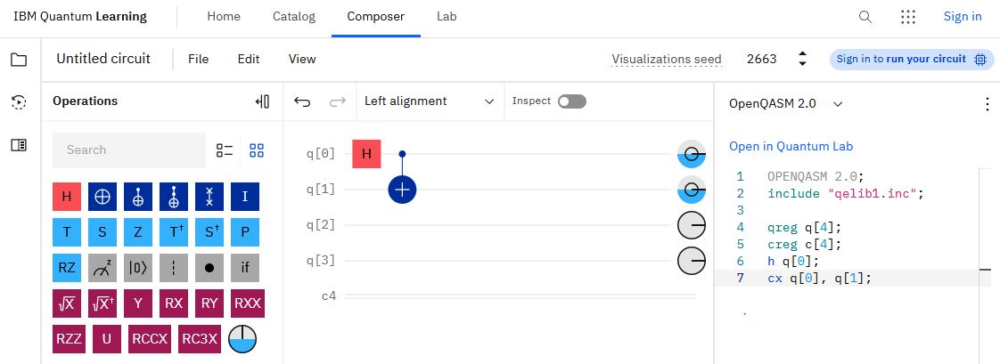
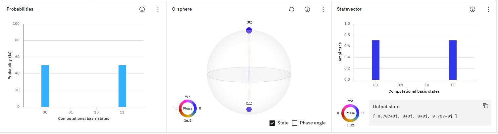
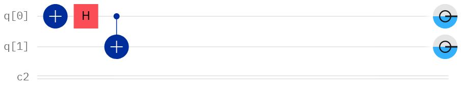

# Der Quantum Composer

Der **Quantum Composer** ist eine interaktive Plattform von IBM. Mit Ihm können Sie per *Drag and Drop* Quantenschaltkreise aufbauen und diese entweder auf einem Simulator oder auf einem echten Quantencoputer laufen lassen. 

Mit diesem direkten Link [quantum.ibm.com/composer](https://quantum.ibm.com/composer), können Sie ihn ohne Login nutzen. Allerdings steht Ihnen bei dieser Variante nur ein Quantensimulator zur Verfügung und die Anzahl Qubits ist auf **drei** beschränkt. Dies reicht aber, für eine Erkundung der Angebote und um die meisten der im Buch beschrieben Schaltkreise auszuprobieren.

Um das ganze Angebot von IBM Quantum nutzen zu können, lohnt es sich, sich ein IBM-Konto einzurichten. Dazu gehen Sie auf [quantum.ibm.com](https://quantum.ibm.com). Nur dann können Sie Ihre Schaltkreise und Codes auch abspeichern und diese auch an einen echten Quantencomputer oder -simulator zur Auswertung senden.

## Detailbeschreibung

Gehen Sie nun über den oben angegebenen Link direkt zum Startbildschirm des Quantumcomposers. Die folgende Abbildung zeigt die obere Hälfte des Arbeitsbereichs.

Dieser Bereich ist in drei Teile geteilt: Links die Palette mit den zur Verfügung stehenden Gates. In der Mitte der Schaltkreis. Jedes Qubit erhält eine horizontale Linie. Auf diesen Linien können aus der Palette die Gates per Drag und Drop platziert werden. Hier wurde das Hadamard-Gate auf das Qubit `q[0]` und anschliessend das $CNOT$ eingefügt. Das $CNOT$-Gate wird hier mit $C_X$ bezeichnet. Die unterste Line, mit `c4` bezeichnet, steht für ein klassisches Register, in dem die Messwerte nach dem Auslesen der Qubits abgespeichert werden. Dieses ist hier auf eine Grösse von 4 Bit eingestellt. So kann jedem Qubit ein Bit zugeordnet werden. In der rechten Spalte ist der Programmtext für den Quantensimulator **OpenQASM** aufgelistet. Hier wird definiert, wie viele Quantenregister (`qreg`) und wie viele klassische Register (`creg`) der Schaltkreis haben soll und welche Gates in welcher Reihenfolge zur Anwendung kommen.

Die Anzahl der Quantenregister sowie die Anzahl und Grösse der klassischen Register können entweder per Mausklick eingestellt werden, indem man mit der linken Maustaste auf ein Symbol `q[4]` bzw. `c[4]` klickt, oder im Programmtext z. B. `qreg[4]` durch `qreg[2]` und `creg[4]` durch `creg[2]` ersetzt. Die Bezeichnungen `qreg` und `qreg` sind übrigens nur Variablennamen und können auch anders gewählt werden.

In der unteren Hälfte des Bildschirms wird der Zustand des Registers auf drei verschiedene Arten dargestellt (s. folgende Abb.). Da wir die Anzahl der Qubits nun auf zwei reduziert haben, gibt es nur noch vier Basiszustände: $00$, $01$, $10$ und $11$:

Links im Histogramm **Probabilities** sieht man die Messwahrscheinlichkeiten des Registers. Da wir hier einen verschränkten Zustand (den Bell-Zustand $\Psi^+$) erzeugt haben, sind nur noch zwei Messwerte - $00$ und $11$ - mit je einer Messwahrscheinlichkeit von $50\%$ möglich. Die **Q-sphere** in der Mitte der Abb. bietet die Möglichkeit, den Registerzustand von bis zu sechs Qubits in einer (an die Bloch-Kugel angelehnten) Darstellung zu verbildlichen. Im Gegensatz zur Bloch-Kugel, mit der nur der Zustand eines Qubits dargestellt werden kann, ermöglicht die **Q-Sphere* die Darstellung der Zustände mehrerer Qubits. Dabei ist der Zustand $\left| 0 \dots 0\right\rangle$ senkrecht nach oben ausgerichtet und der Zustand $\left| 1 \dots 1\right\rangle$ senkrecht nach unten. Die anderen Zustände werden auf Breitenkreisen der Kugel, nach dem Prinzip des **Hamming-Abstands** mit zunehmender Anzahl Einsen (zunehmendem Abstand) von oben nach unten verteilt. Die Grösse des Punktes auf der Kugel steht für die Amplitude und die Farbe für die Phase.

Das Histogramm rechts stellt den **Zustandsvektor** (*Statevector*) dar. Dieses wird nicht automatisch geladen. Der Aufruf erfolgt im Menüpunkt *View$>$Panels$>$Statevector*. Die Höhe der Balken entspricht jetzt aber den Amplituden der Basiszustände und diese betragen hier $1/\sqrt{2}\approx 0.707$, im Unterschied zu den Messwahrscheinlichkeiten von je $0.5$ im *Probabilities-Diagramm* links.

Das Register befindet sich nach der Anwendung der Verschränkungsoperation auf den Anfangszustand $\left|00\right\rangle$ jetzt im  Zustand:

$$
    \Phi^+=1/\sqrt{2}\left| 00\right\rangle +1/\sqrt{2}\left| 11\right\rangle
$$

Unter dem **State-Vector-Diagramm** ist zusätzlich der Zustandsvektor in der Form `[0.707+0j, 0+0j, 0+0j, 0.707+0j]` angegeben. Das entspricht unserer gewohnten Darstellung $1/\sqrt{2}\left| 00\right\rangle+1/\sqrt{2}\left| 11\right\rangle$. Die Terme mit $j$ entsprechen dem Imaginäranteil der Amplituden. In unserem Beispiel sind alle diese Anteile $Null$. Ein Imaginärteil in der Amplitude bedeutet in der Bloch-Kugel-Darstellung einen Anteil in $y$-Richtung.

Schliesslich bleiben noch die Scheibchen am rechten Ende des Schaltkreises zu erklären. Sie enthalten drei Informationen über das jeweilige Qubit, auf dessen Linie sie sich befinden (s. folgende Abb.).

Der Durchmesser des schwarzen Kreises gibt den Verschränkungsgrad mit den anderen Qubits an. Ist der Durchmesser $1$, ist das Qubit nicht verschränkt. Ist der Durchmesser $0.5$, dann liegt maximale Verschränkung vor. Liegt der Durchmesser zwischen $0.5$ und $1$, liegt teilweise Verschränkung vor. Der Füllstand mit blauer Farbe gibt Auskunft darüber, wie gross der Anteil des Zustands $\left|1\right\rangle$ am jeweiligen Qubit-Zustand ist. Da das Register im Zustand $1/\sqrt{2}\left|00\right\rangle+1/\sqrt{2}\left|11\right\rangle$ ist, beträgt dieser Anteil bei beiden Qubits am Gesamtzustand je $0.5$ und die Scheiben sind daher je halb gefüllt. Schliesslich gibt der Zeiger Auskunft über die Phase des $\left|1\right\rangle$-Anteils. Aufgrund des Pluszeichens vor $\left| 11\right\rangle$ zeigt der Zeiger nach rechts, was einem Phasenwinkel in der Bloch-Kugel von $0$° entspricht.

Abgeschlossen wird eine Quantenberechnung durch eine Messung (hier nicht gezeichnet). Dazu zieht man das Messymbol (halbkreisförmige Skala mit Zeiger und dem Buchstaben *z* auf die Linien der zu messenden Qubits.

